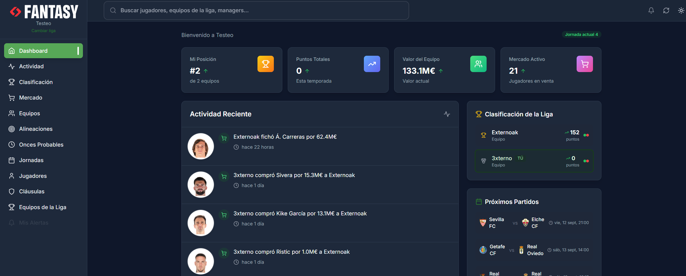

# 🏆 LaLiga Fantasy App

**🌐 Language / Idioma:** [🇪🇸 Español](README.md) | [en English](README_EN.md)

> ⚠️ **Nota**: La aplicación solo está disponible en español. Solo la documentación está traducida al inglés.
> 
> ⚠️ **Aviso legal**: Proyecto **no oficial**. No está afiliado con LaLiga Fantasy ni con futbolfantasy.com.  

> Una plataforma integral de gestión de La Liga Fantasy con información extra de mercado y onces probables de https://www.futbolfantasy.com/

[](https://github.com/Externoak/LaLigaApp)
[](https://reactjs.org/)

[](#plataformas)


## 📖 Descripción general

LaLiga Fantasy Web es una aplicación rica en funciones para gestionar tus equipos de LaLiga Fantasy. Construida con tecnologías web modernas, proporciona una interfaz intuitiva para la gestión de equipos, comercio de jugadores, análisis de mercado y seguimiento de ligas en tiempo real.

### 💡 ¿Por qué esta aplicación?

La Liga Fantasy oficial solo tiene aplicación móvil, dejando a los usuarios de PC sin una experiencia nativa optimizada. Esta aplicación llena ese vacío ofreciendo:

- **Interfaz optimizada para PC**: Aprovecha pantallas grandes y navegación con teclado/ratón
- **Información adicional**: Datos de mercado y onces probables no disponibles en la app oficial
- **Experiencia mejorada**: Funciones adicionales para una gestión más eficiente de tu equipo

Imagen del menu principal:



## 📥 Cómo usar la aplicación

### Descarga y instalación rápida

1. **Descargar**: Ve a [Releases](https://github.com/Externoak/LaLigaApp/releases) y descarga la última versión
2. **Descomprimir**: Extrae el archivo ZIP descargado
3. **Ejecutar**: Haz doble clic en el archivo `.exe` proporcionado

¡Listo! No requiere instalación adicional.

## 🔐 Privacidad y Seguridad

**🛡️ Tus datos están completamente seguros:**

- **Sin servidores propios / datos de sesión locales**: Preferencias y sesión se guardan localmente (encriptados cuando aplica)
- **Sin telemetría**: No enviamos ningún dato personal a servidores externos
- **Sin rastreo**: La aplicación no rastrea tu actividad ni uso
- **Sin análisis**: No recopilamos estadísticas de uso ni información personal
- **Código abierto**: Puedes revisar el código fuente para verificar nuestra transparencia
- **Tokens y OAuth**: Los tokens OAuth (Azure B2C/Google) se almacenan localmente y solo se envían a los endpoints del proveedor para iniciar y refrescar sesión.
- **Borrado de datos**: Desde "Cerrar sesión" se eliminan tokens y datos locales de sesión.

La aplicación solo se conecta a la API oficial de LaLiga Fantasy para obtener datos públicos del juego y de tu liga y también utiliza datos de https://www.futbolfantasy.com para leer datos de tendencias del mercado y onces probables. Nunca enviamos tus credenciales, configuraciones personales o datos de navegación a terceros.

### ✨ Características principales

- 🔐 **Autenticación segura** - Integración OAuth2 con el tenant B2C de LaLiga
- 📊 **Dashboard en tiempo real** - Clasificaciones en vivo, estadísticas de equipos y tendencias del mercado
- 🔍 **Búsqueda avanzada** - Búsqueda global entre jugadores, equipos y managers
- 💰 **Gestión de mercado** - Comercio de jugadores, pujas y análisis de mercado
- 📱 **Multiplataforma** - Web, Electron desktop
- 🌙 **Modo oscuro/claro** - Tema personalizable con detección de preferencia del sistema
- 🔄 **Auto-actualizaciones** - Actualizaciones seamless de la aplicación para versiones de escritorio
- 📈 **Tendencias del mercado** - Análisis del mercado en tiempo real y valoraciones de jugadores

## 📊 Origen y uso de datos

- La app obtiene datos directamente desde el dispositivo del usuario hacia los servicios de terceros.
- No operamos servidores propios ni redistribuimos datos o contenido de terceros.
- No almacenamos de forma persistente ni reempaquetamos contenidos de terceros para su descarga.
- Respetamos cabeceras y límites de uso.

## 📋 Términos de terceros

Esta aplicación accede a servicios de terceros (p. ej., LaLiga Fantasy y futbolfantasy.com). El uso de dichos servicios está sujeto a sus Términos y Políticas.
El proyecto no fomenta ni permite eludir medidas técnicas, scraping prohibido ni usos contrarios a dichos términos.

## 🚀 Inicio rápido para desarrolladores

### Requisitos previos

- **Node.js** 16.0.0 o superior
- **npm** 7.0.0 o superior
- **Git** para clonar el repositorio

### Instalación

1. **Clonar el repositorio**
   ```bash
   git clone https://github.com/Externoak/LaLigaApp.git
   cd LaLigaApp
   ```

2. **Instalar dependencias**
   ```bash
   npm install
   ```

3. **Iniciar servidor de desarrollo**
   ```bash
   npm run dev
   ```

   Esto iniciará un servidor unificado en el puerto 3005 que incluye:
   - Servidor web con la aplicación React
   - Servidor proxy CORS para la API de LaLiga Fantasy

4. **Abrir navegador**
   Navega a `http://localhost:3005` para acceder a la aplicación

   **📱 Acceso desde dispositivos móviles**: La aplicación muestra la URL de red local al iniciar (ej: `http://192.168.x.x:3005`). Usa esta URL para acceder desde tu móvil u otros dispositivos en la misma red. La interfaz está optimizada para dispositivos móviles.

## 🖥️ Plataformas

### Aplicación Web
```bash
npm start          # Servidor de desarrollo
npm run build      # Build de producción
```

### App de Escritorio Electron
```bash
npm run electron:dev    # Modo desarrollo
npm run electron        # Build y ejecutar
npm run build:electron  # Empaquetar para distribución
```

## 🏗️ Estructura del proyecto

```
LaLigaApp/
├── public/                 # Assets estáticos y service workers
├── src/
│   ├── components/        # Componentes React
│   │   ├── Auth/         # Componentes de autenticación
│   │   ├── Common/       # Componentes reutilizables
│   │   ├── Dashboard/    # Widgets del dashboard
│   │   ├── Layout/       # Layout de la aplicación
│   │   ├── Market/       # Mercado y comercio
│   │   ├── Players/      # Gestión de jugadores
│   │   ├── Teams/        # Gestión de equipos
│   │   └── Settings/     # Configuraciones de la aplicación
│   ├── services/         # API y lógica de negocio
│   ├── stores/           # Gestión de estado (Zustand)
│   ├── styles/           # Estilos globales y Tailwind
│   └── utils/            # Funciones de utilidad
├── scripts/              # Scripts de build y despliegue
├── main.js               # Proceso principal de Electron
├── preload.js            # Script de preload de Electron
├── http-proxy.js         # Proxy CORS de desarrollo
└── tailwind.config.js    # Configuración de Tailwind CSS
```

## 🛠️ Tecnologías principales

### Frontend
- **[React 18](https://reactjs.org/)** - Biblioteca de UI basada en componentes
- **[React Router v6](https://reactrouter.com/)** - Enrutamiento del lado cliente
- **[Tailwind CSS](https://tailwindcss.com/)** - Framework CSS utility-first
- **[Framer Motion](https://www.framer.com/motion/)** - Biblioteca de animaciones
- **[React Query](https://tanstack.com/query/)** - Obtención de datos y caché

### Gestión de estado
- **[Zustand](https://zustand-demo.pmnd.rs/)** - Gestión de estado ligera
- Almacenamiento persistente para autenticación y preferencias
- Actualizaciones en tiempo real y sincronización

### Herramientas de build
- **[Create React App](https://create-react-app.dev/)** - Herramientas de desarrollo y build
- **[Electron](https://www.electronjs.org/)** - Framework de aplicaciones de escritorio

## 🔧 Desarrollo

### Scripts disponibles

| Comando | Descripción |
|---------|-------------|
| `npm start` | Iniciar servidor de desarrollo React |
| `npm run build` | Build para producción |
| `npm test` | Ejecutar suite de pruebas |
| `npm run dev` | Iniciar entorno de desarrollo con proxy |
| `npm run server` | Iniciar solo el servidor proxy CORS |
| `npm run electron:dev` | Ejecutar Electron en modo desarrollo |

### Configuración del entorno

La aplicación usa un servidor unificado que sirve tanto la aplicación React como el proxy CORS:

- **Servidor Unificado**: `http://localhost:3005`
- **Target API**: `https://api-fantasy.llt-services.com`

### Autenticación

La app usa OAuth2 con el tenant Azure B2C de LaLiga:
- OAuth de Google para login social
- Autenticación email/contraseña
- Gestión de tokens JWT con refresco automático
- Almacenamiento persistente de sesión

## 🎨 Personalización

### Temas

La aplicación soporta temas comprehensivos a través de Tailwind CSS:

```javascript
// tailwind.config.js
module.exports = {
  theme: {
    extend: {
      colors: {
        primary: {
          // Paleta verde personalizada
          50: '#f0f9f0',
          500: '#2d7d2d',
          900: '#123412',
        },
        dark: {
          // Colores modo oscuro
          bg: '#0f172a',
          card: '#1e293b',
          border: '#334155',
        }
      }
    }
  }
}
```

### Estructura de componentes

Todos los componentes siguen un patrón consistente:
- Componentes funcionales con hooks
- Listo para TypeScript (comentarios JSDoc)
- Diseño responsivo con enfoque mobile-first
- Consideraciones de accesibilidad (etiquetas ARIA)

## 🔐 Seguridad

- **Seguridad de tokens**: Tokens JWT almacenados de forma segura con refresco automático
- **Protección CORS**: El servidor proxy valida orígenes
- **Validación de entrada**: Validación del lado cliente y servidor
- **Privacidad de datos**: No se registran datos sensibles en producción
- **Comunicación segura**: Aplicación de HTTPS para llamadas a API

## 📦 Build para producción

### Despliegue Web
```bash
npm run build
# Despliega el directorio 'build' a tu servidor web
```

### Distribución Electron
```bash
npm run build:electron
# App empaquetada disponible en el directorio 'dist'
```

## 🤝 Contribuir

¡Damos la bienvenida a las contribuciones!

### Flujo de trabajo de desarrollo

1. Hacer fork del repositorio
2. Crear una rama de feature (`git checkout -b feature/amazing-feature`)
3. Commit tus cambios (`git commit -m 'Add amazing feature'`)
4. Push a la rama (`git push origin feature/amazing-feature`)
5. Abrir un Pull Request

### Estándares de código

- Usar la configuración de ESLint proporcionada
- Seguir patrones de componentes funcionales de React
- Escribir mensajes de commit significativos
- Agregar comentarios JSDoc para funciones complejas
- Asegurar compatibilidad de diseño responsivo

## 🐛 Solución de problemas

### Problemas comunes

**Errores de build**
```bash
# Limpiar caché y reinstalar
rm -rf node_modules package-lock.json
npm install
```

## 📝 Licencia

Este proyecto se distribuye bajo **GPL-3.0-or-later** con **Términos Adicionales — Atribución (GPLv3 §7)**.  
Consulta **[LICENSE](./LICENSE)** y **[NOTICE](./NOTICE)** para el texto completo.

### ✅ Resumen de atribución (obligatorio)
Si redistribuyes este proyecto o creas trabajos derivados, incluye una **mención visible** al proyecto original **de una de estas formas**:

- **Documentación** (README, manual o sitio web del proyecto), **o**
- **Interfaz de usuario** (por ejemplo, "About/Acerca de", "Créditos" o pantalla de inicio).

**Texto recomendado de crédito:**
> Este producto incluye 'LaLigaApp' (c) 2025–presente Externoak — https://github.com/Externoak/LaLigaApp/

## Idiomas
- **Español** (principal)
- **Inglés** - Ver [README_EN.md](README_EN.md)

## 🎓 Propósito educativo

Esta aplicación fue creada con **fines educativos y de aprendizaje**, utilizando tecnologías modernas como React, Electron y web scraping. Es un proyecto de **semi-vibecoding sin ánimo de lucro** para explorar el desarrollo con AI, aplicaciones de escritorio y APIs.

**Objetivos del proyecto:**
- Aprender desarrollo con Electron y React
- Experimentar con integración de APIs
- Practicar técnicas de web scraping
- Crear herramientas útiles para la comunidad fantasy

## 📞 Soporte

- **Issues**: [GitHub Issues](https://github.com/Externoak/LaLigaApp/issues)

---

> ⚖️ **Aviso legal**: Esta es una aplicación no oficial que utiliza APIs NO públicas.  
> No está afiliada con LaLiga Fantasy ni futbolfantasy.com.  
> ⚠️ Úsala bajo tu propio riesgo.

<div align="center">
  <p>Hecho con ❤️ por <strong>Externoak</strong></p>
  <p><em>Aplicación no oficial para LaLiga Fantasy</em></p>
</div>
